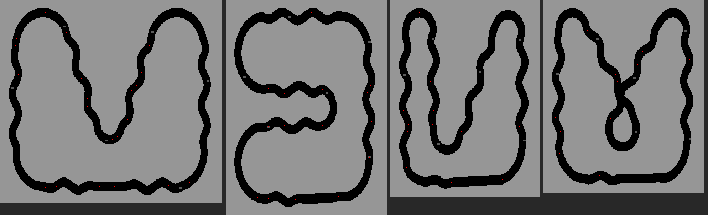

# SPEEDMAZA GRAND PRIX

A race for up to three cars on Atari XL/XE, made from
[SPEEDMAZA RACE](../race). It keeps SpeedMaza's look: status bar, DLI colour
bands, two-colour tracks with walls pulsing to the music, and the "MAZA
PASSED!" screen. It races on the four tracks of the PICO-8 "1k racing" game
([`../picospeed.txt`](../picospeed.txt)), drawn twice the PICO-8 size, with
S-bends on the straights and a road wide enough for three cars.



## Options screen

Joystick up/down picks a line, left/right changes it. Fire, SPACE or START
starts the race.

| Option | Choices |
|---|---|
| PLAYERS | 1 (you + 2 computer cars) or 2 (joysticks 1 and 2 + 1 computer car) |
| TRACK | 1–4 |
| LAPS | 1–5 |
| DIFFICULTY | EASY, NORMAL or HARD: how fast the computer cars drive, how much they brake before bends, how hard they chase you, and how eagerly they use their booster |
| SPEED | SLOW, NORMAL or FAST: start speed, how fast it grows, and its limit |
| MORE OPTIONS | Opens the second page (right or fire) |

**MORE OPTIONS page** (BACK or fire returns):

| Option | Choices |
|---|---|
| OIL | ON or OFF: oil patches on the road |
| FLASH | How much the screen flashes. NONE: steady colours (also a still countdown). SOFT: the walls pulse gently with the music, nothing flashes. NORMAL: as in SpeedMaza, the pulsing grows and the road and borders flash late in the race. HARD: the same, four times sooner |
| MAP | ON or OFF: the track map in the status bar |
| BOOSTER | ON or OFF |

The HI SCORE is the best human score.

## Racing

- **Start:** four screens like SpeedMaza's crash screen, shaking and
  flashing (still with FLASH NONE): 3, 2, 1, START, with beeps. Then the race
  starts at once; "GO!" and the track and laps show for a moment.
- **Controls:** joystick left/right steers. Up/down makes the car a little
  faster/slower (±25%). Everybody's speed also grows with time, as in
  SpeedMaza.
- **Booster:** "P1 BOOST" at the top left (player 2: "P2 BOOST" at the
  top right) shows your booster charge as a bar of 9 segments and a number.
  It grows from 1 to 9, one step about every 1.5 seconds. Hold fire to go
  50% faster while it lasts; a full 9 lasts 3 seconds.
- **Walls:** you can't leave the road. The car bangs (noise), bounces back,
  turns a little towards the track, is slowed for half a second, and loses
  **25 points**.
- **Other cars:** cars that touch swap speeds and are pushed apart (thud).
- **Oil** (grey patches): the car spins round once at half speed, sliding
  with almost no grip, and comes out a little off its old direction.
- **The screen** follows you in 1-player mode, and the leading human in
  2-player mode.
- **Falling behind (2 players):** if the trailing player drops off the
  screen, they come back just behind the leader, on the leader's lap, and
  lose **100 points**.
- **Computer cars** are never put back. They drive on out of sight with the
  same physics and walls (the game checks their position against the
  track), take their checkpoints and laps, and reappear when they catch up
  or are caught.
- **Catching up:** a computer car that is behind you and off the screen
  boosts to get back: with its own booster charge, or, when that is empty,
  with a free boost (+75%, a little cheating that only works out of sight
  behind you). It keeps boosting for 1.5 seconds after it is back on the
  screen, so it really rejoins the race.
- **Points:** +10 per checkpoint (about 110–130 per lap). The winner of a
  race gets **+1000**, second place **+500**.
- **End of a race:** it ends a moment after the second car finishes. The
  results screen lists the cars by points.
- **ESC** goes back to the options.

The status bar at the top shows the booster of each player (left and right)
and, with MAP on, a map of the whole track in the middle: grey, with the next stretch ahead of you (the leading human in
2-player mode) in yellow, so you can see the coming bends, and every car as
a dot in its colour. The two lines at the bottom show each
car's points and lap (or its place), in the car's colour: orange (P1), blue
(P2 or AI) and green (AI).

## Build and run

```sh
../decompiled/build.sh regen      # once: makes ../decompiled/unpacked.bin
./run.sh                           # play (builds grandprix.xex if needed)
./run.sh rebuild                   # rebuild, then play
./run.sh auto                      # watch a self-driving race (testing)
```

Needs `mads`, and Python 3 with numpy and Pillow. XL/XE with BASIC off (the
file switches BASIC off while loading).

## How it works

- **Tracks.** `tools/make_data.py` draws each PICO-8 track into an ANTIC
  mode 8 map, as the race does, and stores every row as its road spans.
  Most rows are stored as small changes from the row above. That stream and
  the checkpoint tables are packed with a small LZ77 variant, about 2 KB per
  track, 8 KB for all four.
  - Three packed tracks load at `$6000` and are moved to `$0700-$1FFF` at
    start-up, where DOS was; the fourth sits after the code.
  - When a race starts, `LoadTrack` unpacks the chosen track to `$6000` and
    rebuilds the rows in the work area at `$3000`. From there they are
    unpacked into the ring of 32 rows as the screen scrolls.
  - The generator checks that its Python copy of this rebuild gives the
    same rows, and the 6502 code was checked against it in a simulator.
- **Computer cars.** They steer towards the next checkpoint. Their throttle
  is: difficulty level, minus braking by the sharpness of the next bends
  (precomputed per checkpoint), plus a rubber band (faster when behind the
  best human, slower when ahead).
  - Off the screen there are no collision registers, so each frame their
    centre is looked up in the track's span rows (`OnRoad`), and a wall
    bounces them as on screen.
  - After any wall hit a car also steps a few pixels towards its next
    checkpoint, which becomes its safe place, so a car pressed against a
    wall always gets back onto the road.
- **Oil.** Patches are drawn into the rows as they are unpacked (colour 1).
  The PnPF collision bit for colour 1 makes a car slide.
- **Minimap.** The status bar is the game's own mode E picture (29 lines).
  The track is drawn from the checkpoints, and each point halfway between
  them, at 1/96 of the world size in both directions. A mode E pixel is
  about as wide as 1.6 scan lines, as a colour clock of the world is, so
  the shape is kept.
  - The car dots are the cars' own players: DliGame puts them at the
    minimap positions for the status bar, then moves them back to the cars
    and clears the collision registers before the track begins. So that
    the track's collisions are not lost, DliGame first saves the registers
    (still holding the whole frame before), and the game reads that copy.
  - DliGame can interrupt the game at any moment, so every horizontal
    position it copies (carHpos, miniHpos) is worked out first and stored
    with a single write.
- **Booster display.** "P1 BOOST" / "P2 BOOST" are drawn with a small 5 x 7
  font when the race starts; the bars (one byte per segment) and the number
  are redrawn only when the charge changes.
- **Sound.** Effects play on channel 4, written right after the RMT player
  each frame, so they sound over the music.
- **The rest** is as in the first version: players 0-2 are the cars,
  hardware collisions for walls and cars, respawn from the leader's
  position history, and two text lines under the track.

## Tuning

At the top of `grandprix.asm`: `TURN`, `THR_MAX`, `GRIP_*`, `OIL_TIME`,
`SPIN_TIME` (oil spin), `BOOST_MAX/FILL/USE` (booster), `STUN_*` and `PT_*`
(points). `CS_FRAMES` sets how long each 3-2-1-START screen stays, and
`aiBoostMin/aiBoostBend` when computer cars boost; `CATCH_ON` how long a
catching-up car keeps boosting once it is back on the screen. Next to the options screen:
`spdStart/spdAcc/spdMax` (the SPEED choices), `optDefault` (the options at
power-on) and `aiLevel/aiBrake/aiBand` (the DIFFICULTY choices).

In `tools/make_data.py`: `SCALE`, `ROAD_R`, `WIGGLE_*` (track shape), `GRID`
(starting places) and `OIL` (patches per track).

For testing, `mads grandprix.asm -d:AUTOPILOT=1 -d:TESTOPT=1` builds a
self-driving 1-lap race; with `-d:AUTOPILOT=2` car 1 does not steer and
drives into the walls (to check wall hits).
