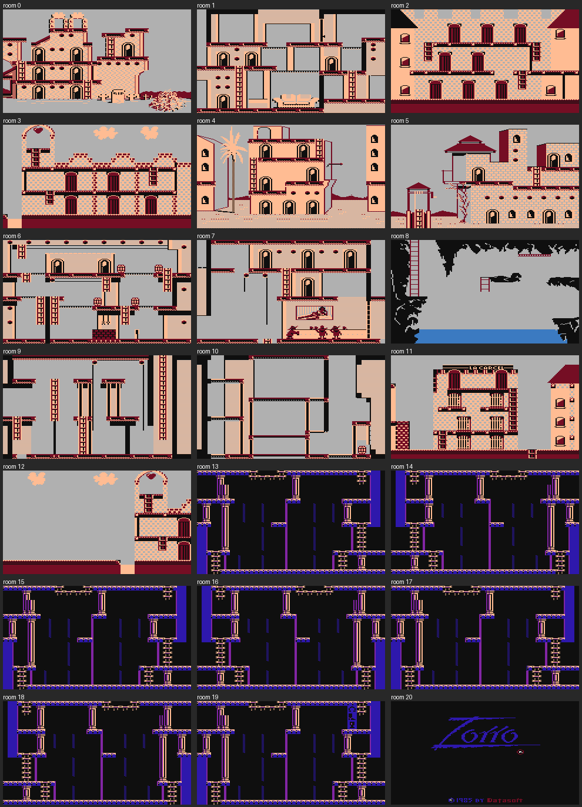

# Zorro (1985, Datasoft) — disassembled

`../Zorro (1985)(Datasoft)(US).xex` is an Atari XL/XE game written in 6502
assembly. This folder holds a MADS source for it, generated by a tracing
disassembler, with names and comments added by hand. `zorro.asm` assembles
back to **the original file, byte for byte**.

## The game

Zorro walks, climbs and jumps through 21 flick-screen rooms: 13 rooms of the
town, 7 catacomb rooms under it, and a title room. He fences with a soldier,
carries one item at a time and uses it in the right place:

- two bells, hung in the tower in room 0, make the tower ladder appear;
- a horseshoe, a boot and a goblet are treasures;
- prisoners in the jail (room 11, "LA CARCEL") can be freed;
- money bags in the catacombs are worth points;
- a trapdoor in the jail drops Zorro into a random catacomb room and costs
  a life.

He wins by bringing the flower to the señorita on her balcony in room 5. His
remaining lives are then counted into the score.

The status line shows Score, High, Bonus and Lives. The bonus counts down
while you play and is added to the score when you solve something. You start
with 4 lives.

Keys: **SPACE** pause, **S** music on/off, **L** / **R** flipped / normal
joystick, **V** show the credits line ("Zorro (c)'85 Datasoft,Inc.James Garon
V2"), **START** new game.

`rooms.png` and `objects.png` are drawn from the game data by
`tools/render.py`:

## Files

| File | What it is |
|---|---|
| `zorro.asm` | MADS source: named routines, variables, object table, display list, text |
| `zorro.xex` | Output of `build.sh`; identical to the original |
| `zorro.lst` | MADS listing: address and bytes for every line |
| `data/rom_*.bin` | The six data chunks that go into the RAM under the OS ROM (room graphics) |
| `rooms.png`, `objects.png` | All rooms, and the starting sprite of each object |
| `tools/disasm.py` | Generates `zorro.asm` and `data/` from the original file |
| `tools/symbols.py` | All names, comments and tables that `disasm.py` uses |
| `tools/trace.py`, `tools/opcodes.py` | Recursive-descent code finder, 6502 opcode table |
| `tools/xex.py` | Reads the XEX and builds the RAM image the game starts with |
| `tools/verify.py` | Shows where a rebuilt XEX differs from the original |
| `tools/render.py` | Draws `rooms.png` and `objects.png` (needs Pillow) |
| `build.sh` | `./build.sh` assembles and compares; `./build.sh regen` regenerates the source first |

To change a name or a comment, edit `tools/symbols.py` and run
`./build.sh regen`. To change the game, edit `zorro.asm` and run `./build.sh`,
which then reports where the result differs from the original.

## How the original file works

There is no compression.

1. A small copier loads at `$8000`.
2. Six chunks of up to 2.5 KB load at `$4000`. After each one, an INIT runs
   the copier. It switches the OS ROM off (`PORTB=$FE`) and copies the chunk
   into the RAM under the ROM, at `$D800-$FFFF` and `$C000-$CEFF`.
3. The program loads at `$1480-$4D7F`. The sound driver, sprites and tables
   load at `$5BE8-$84E7`.
4. RUN at `$5000` moves `$1480-$4D7F` down to `$0480` and jumps to
   `$0480`.

The game runs with the OS ROM on. It switches the ROM off only in
`CopyBlocks`, which copies a room's tiles and map from under the ROM. The
copy protection (`Protection`, room 5) has already been defeated in this
file: the jump to "Disk Error - Press START" is replaced by NOPs.

Each data segment in the original starts with its own `$FFFF` header. MADS
would only write the first one, so `zorro.asm` uses `opt h-` and writes every
segment header itself.

## Memory map (while the game runs)

| Address | Contents |
|---|---|
| `$0480` | `JMP ColdStart` |
| `$0483-$04B4` | Status line fields (score, high score, bonus, lives) and `room_state` |
| `$04B5-$0575` | Display list: 3 text lines (status), 176 lines of mode E |
| `$0574-$065B` | Starting values of `obj_on/obj_x/obj_y/obj_room` |
| `$065C-$0A6F` | Object table: 18 arrays of 58 bytes (`obj_on`, `obj_x`, `obj_y`, `obj_room`, `obj_mode`, `obj_timer`, `obj_dx`, `obj_dy`, ...) |
| `$0A70-$2E53` | Code: main loop, room loader, sprites, score, object handlers, physics. Tables between routines |
| `$2E54-$34BA` | Collision rectangles of each room |
| `$34BB-$3504` | `CopyBlocks`: copy from under the OS ROM |
| `$3505-$3D7F` | Room data sizes, room 19's map, title tiles and map |
| `$3D80-$4D7F` | Left over by the RUN stub (a copy of `$2D80-$3D7F`) |
| `$5480-$5BE7` | Packed room map, unpacked map at `$57E8`, then the sprite background buffers (run time) |
| `$5BE8-$5F86` | Room exits, soldier patrols, sprite mask table (`$5E87`) |
| `$5F87-$640C` | Sound driver: jump table, effects, song lists, variables |
| `$640D-$84E7` | Three songs, physics flags (`$68A2`), sprites |
| `$8470-$9FEF` | Screen A (176 lines × 40 bytes) |
| `$9FF0-$A3F7` | The room's tile set (copied from under the ROM) |
| `$A3F8-$A46F` | Status text line |
| `$A470-$BFEF` | Screen B |
| `$C000-$CEFF`, `$D800-$FFFF` | Under the OS ROM: tiles and maps of rooms 0-18 |

## How the game works

- **Main loop** (`MainLoop`). One game step happens every 5 frames
  (`frame_wait`, counted down by the VBI). Each step:
  1. `CheckExits`: change the room if Zorro stands on an exit.
  2. `EraseAll`: restore the background behind every sprite.
  3. `RunHandlers`: call each active object's handler through a patched
     `JSR` (`call_handler`).
  4. `CheckKeys`.
  5. `DrawAll`: draw the sprites into the back buffer.
  6. Set `flip_req`; the VBI then swaps the two screens by patching the
     display list's LMS bytes.
- **Objects.** There are 58, and each one has a handler (`obj_handler_lo/hi`).
  `obj_room` is the object's room, `$FF` for every room, or `$80` for every
  catacomb room. Object 0 is Zorro, 1 is his sword, 5 is the soldier and 6
  the soldier's sword. A carried item copies its position from Zorro's
  animation frame (`PlaceAtZorro`).
- **Sprites** (`DrawObject`, `EraseObject`) are software sprites in mode E.
  Each one is a width byte, a height byte, then the pixels. `mask_tab` gives
  the mask for every possible byte. Clipping keeps sprites inside the room
  area.
- **Physics** (`MoveWith`). An object's box is tested against the room's
  collision rectangles (`rect_type`, `rect_x1`, ...), which set flags at
  `$68A2`. Moving platforms, the see-saw and the stones in the cave river
  move their own rectangles.
- **Rooms** (`LoadRoom`). `CopyBlocks` copies the tile set (8×8 mode E
  tiles) to `$9FF0` and the packed map to `$5480`. The map is unpacked: a
  byte below `$80` is a tile, `$80+n` repeats the next byte n times, and
  `$80` ends the map. The 40×22 tiles are then drawn into both screens. Each
  room's four colours are set by the DLI under the status line.
- **Text** (`PrintAt`). Each string starts with a column byte and ends with a
  byte `>= $80`. Character codes below `$20` are EORed with `$10`, so digits
  can be stored as 0-9.
- **Sound** (`SndPlay`, at `$5F96`):
  - `A` = 1 or 2 plays song list 1 or 2; 3 or 4 plays song list 3 (town,
    catacombs and game over music).
  - `A` ≥ 5 plays sound effect `A-4` on channel 4.
  - The VBI calls `SndUpdate`.

## About the names

The disassembly itself is exact. The names and comments are mine, worked out
from the code and from the pictures in `rooms.png` and `objects.png`. They
are reliable for:

- the engine: main loop, rooms, sprites, text, score, sound, physics entry
  points;
- the object table;
- the handlers of objects whose role is clear (Zorro, swords, soldier, bells,
  key, money bag, treasures, bull, see-saw, stones, señorita, prisoners,
  trapdoor).

Handlers I didn't work out are named `ObjNN_Handler` after the first object
that uses them. Labels written as `Lxxxx` (code), `Sxxxx` (subroutine) and
`Dxxxx` (data) are places that are referenced but not named yet.

How it was checked:

- `build.sh` checks that `zorro.xex` equals the original file. That holds for
  every byte, including the data under the ROM and the unused leftovers.
- `tools/trace.py` finds code by following jumps from the start, the
  interrupt handlers and the object handler table. Code that is never
  reached is marked by hand in `symbols.py` (`EXTRA_ENTRIES`). It includes
  `DebugExit`, the `DiskError` path and an unused sound VBI setup.
