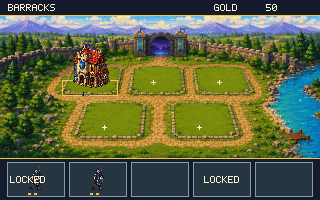
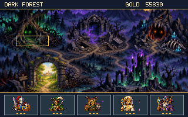
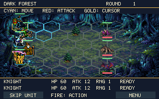

# Greenhaven — native Atari VBXE city

A playable native city, encounter map and tactical battle game. The Lowrez-based
preset starts with **50 gold, level-2 Barracks and two Spearmen**. Other buildings
start empty. Each building has three appearances. Four buildings unlock stronger recruits;
building upgrades do not alter troops already recruited. Chapel is a support building: level 1 unlocks slot 4, level 2 unlocks slot 5, and level 3 reduces every recruit price by 10 gold. Starting capacity is 3. See
[LOWREZ-UPDATE.md](LOWREZ-UPDATE.md) for current prices, encounters and limitations.

The city connects to a dark fantasy encounter map and an integrated native VBXE
battle view. Recruit any combination of up to five individual fighters after Chapel upgrades: **five Militia
or five Swordsmen are legal**, as are mixed armies. Each fighter has independent
HP, actions, upgrades and dismissal. No stacks or troop quantities are used.
The earlier standalone battle prototype remains independently runnable.
Restarting the executable starts a new city; disk saves are not implemented.



## Play

Open **[city-vbxe.xex](city-vbxe.xex)** in Altirra with VBXE enabled, or on an
XL/XE with VBXE FX 1.2x. No external asset files are needed when playing.

- **Joystick:** move between buildings, the gate and five army slots. Down from
  a lower-row building enters the army strip; Left/Right selects a slot and Up
  returns to the buildings. Release between movements.
- **Fire:** inspect a building or army slot. In a popup, Up/Left selects the
  previous action and Down/Right selects the next; Fire confirms.
- The top bar names the focused building, gate, unit or empty army slot.
- **W/A/S/D or arrow keys:** keyboard navigation.
- **Enter or Space:** inspect/confirm.
- **Escape or SELECT:** close the popup without buying.

## City gate and encounter map

Select the **dark gate in the top-center city wall**, then press Fire.
Press Up from any top-row building to reach it. The original wall gate is
slightly enlarged and shows the dark enemy territory inside, with no text sign.
The large left-side portal has been removed. The city starts with two Spearmen and 50 gold.

On the map, joystick or W/A/S/D moves between five fixed landmarks:

- **Dark Forest:** twisted roots, webs and lurking beasts.
- **Catacombs:** a skull-carved gate into haunted burial tunnels.
- **Monster Caves:** a fanged cavern mouth, bones and glowing eyes.
- **Necromancer Ruins:** shattered spires, undead and spectral fire.
- **Back to Greenhaven:** the larger lower-left stone arch, with a peaceful green landscape and warm sunlight inside; Fire returns to the city.

Selecting a hostile location opens its report. Choose **Fight** or **Back**.
An empty army cannot enter combat. Dark Forest is available first; three victories
on its successive contracts unlock Catacombs, then Monster Caves, then Necromancer
Ruins. Each region has three authored contracts, for twelve total. Replaying a
completed region pays a smaller practice reward without advancing its counter.



## Integrated battle controls and rules



- Move the hex cursor with joystick, WASD or arrows. Fire on an unacted friendly
  fighter selects it; Fire on a cyan destination moves; Fire on a red-highlighted
  enemy attacks. Gold outlines show the cursor; bases are blue for friends, red
  for enemies, and gold for the active hero. Health is shown numerically in the bottom panel; no floating health bars.
- Retain the old prototype's turn rule: a Move-2 hero can move one hex and attack,
  or spend both movement points moving and finish. Attacking without moving is
  allowed. Heroes can be selected in any order; their spent actions persist.
- **Double Fire on the same selected ally’s hex** skips that fighter’s turn.
  Release Fire between presses; the second press must arrive within about half
  a second. A single press selects, and moving the cursor cancels the pair.
- **Skip Unit** is reachable by moving Down past the bottom battlefield row.
  **Menu** is beside it. Escape/SELECT also opens the battle menu, defaulting to
  Resume. The menu offers Skip Unit, Retreat and Resume.
- After every hero has acted, enemies take their turns. Enemy targeting scans
  every deployed hero, including slot five. Enemies may repeat types too.
- Trees, pillars and rocks occupy the same two central cells in this first set
  of layouts. They block movement and shots. Precomputed symmetric sight tests
  use the same terrain as the movement grid. Bodies block movement, not shots.
- Combat uses fixed damage and the recovered low-HP Lowrez values and labeled additional-unit proposals.
  Movement animates, attacked sprites flash, bottom HP, damage, remaining movement and shooting stats update.
- Victory pays gold exactly once and advances the current contract. Completing
  three contracts unlocks the next region; there are no extra region bonuses. Defeat or retreat pays nothing. All recruited
  fighters recover after combat; campaign army slots are never removed by death.
- Fire or Escape on the result returns to the encounter map. The city return
  gate remains available. Held Fire cannot also trigger the next action.

Warlocks summon Demons instead of shooting. Defeating the Warlock wins immediately.
The shared battle capacity is 12 individuals; summoning stops when that capacity
is reached. The game retains player/enemy phases, the 7×6 board and blocked shots,
rather than reproducing Lowrez's initiative queue and unobstructed range search.
Armor, healing and flight are not implemented. Campaign balance remains a playtest
preset using the imported JSON values; encounter difficulty still needs playtesting.

Building popups offer **Build/Upgrade Building**, **Recruit Current Unit**, and
**Back**, with gold prices on the action rows. The unit preview and stats follow
that action: the next unlocked unit for a building upgrade, or the current-level
unit for recruitment. An unbuilt plot must be built before recruiting.

Recruitment fills the **first empty unlocked army slot**, regardless of building order.
Duplicate types and different tiers of the same family may coexist. Selecting an
occupied army slot offers:

- **Upgrade:** advance one unit tier when its building has unlocked that tier.
  The price is the difference between the next and current unit prices.
- **Dismiss / Refund:** remove that fighter and return half the gold actually paid for it (including upgrades), rounded down. Remaining units keep their positions; the next recruit
  fills the earliest hole. Gold is capped at 65,535 to prevent overflow.
- **Back:** close without changing anything.

An empty slot opens an information panel directing you to recruit at a building.
Unavailable actions cannot spend gold. Insufficient funds or a full army leave the army and treasury unchanged. The five visual
army cards show portraits and one to three gold tier pips. The focused army
slot has a gold border. Empty available cards have no text or placeholder fighter; unavailable slots show LOCKED.

Fire and keyboard confirmation are merged into a single logical press. Holding
Space/Enter, OS keyboard repeat, or an emulator mapping the same key to joystick
Fire and keyboard input cannot repeatedly open, purchase or close a popup.
Release confirmation inputs before the next press; two neutral polls rearm it.
Back stays closed until a new press.

## Build

Requires MADS 2.x, Node.js, and ImageMagick's `convert` and `identify` commands.

```sh
cd steamlinejs/heroes/atari/city
./build.sh
```

On this workspace's WSL/Windows setup, `./run-emulator.sh` builds and starts the
XEX using the existing Altirra profile and repository launcher.

For launching the existing executable without rebuilding, run
`steamlinejs/heroes/run-city.sh` from the workspace root. It works from any
working directory when invoked by its full path. Add `--build` to rebuild first.

## Replace artwork

The source illustrations were created with the built-in image generation tool.
The prompt set is in [assets/PROMPTS.md](assets/PROMPTS.md). Build-time resizing,
chroma-key extraction and palette conversion turn them into Atari assets.

**Edit these individual inputs**, then run `./build.sh`:

| File | Size | Purpose |
|---|---|---|
| `assets/city-background.png` | 320×200 | Town scenery and empty plots |
| `assets/encounters-background.png` | 320×200 | Encounter-map scenery and landmarks |
| `assets/barracks-1.png` through `barracks-3.png` | 56×64 each | Barracks levels |
| `assets/archery-1.png` through `archery-3.png` | 56×64 each | Archery levels |
| `assets/lodge-1.png` through `lodge-3.png` | 56×64 each | Ranger lodge levels |
| `assets/chapel-1.png` through `chapel-3.png` | 56×64 each | Chapel levels |
| `assets/tower-1.png` through `tower-3.png` | 56×64 each | Wizard tower levels |
| `assets/unit-<building>-1.png` through `unit-<building>-3.png` | 32×28 each | Unit portraits for all five building families |

Use transparent PNG building cells, centered on the same ground baseline.
Keep shorter buildings lower in their cell so upgrades actually grow upwards.
The build preserves existing individual PNGs; it only extracts missing files
from `buildings-source.png`. Similarly, `city-top-gate-source.png` is the
high-resolution source used only when `city-background.png` is absent.
Replacing a source sheet alone does not overwrite edited component inputs.
The unit atlas source is `assets/units-source.png`; its prompt is recorded in
[assets/UNIT-PROMPT.md](assets/UNIT-PROMPT.md). Individual unit PNGs are preserved
on rebuild in the same way as the building PNGs.
The map source is `assets/encounters-return-source.png`; the original generation
prompt is in [assets/MAP-PROMPT.md](assets/MAP-PROMPT.md), and both current gate
edit prompts are in [assets/PORTAL-PROMPTS.md](assets/PORTAL-PROMPTS.md).
The current smaller top-center city gate uses
[assets/TOP-GATE-PROMPT.md](assets/TOP-GATE-PROMPT.md). Earlier source art is
retained for reference. Replace `encounters-background.png`
to update the map. `encounters.inc` contains its location names, descriptions,
highlight coordinates and directional navigation graph.

`content.json` defines plot positions, starting levels, gold, unit names and
stats. `costs` contains the three building prices; `recruitCosts` contains the
three unit prices per family, strictly increasing by tier. Building art order is Barracks, Archery, Lodge, Chapel, Tower. Each
building's levels are contiguous in the exported sprite bank. No assembler
changes are needed to replace one building picture or change a price.

All artwork shares an automatically generated palette: index 0 is transparent,
1–15 are reserved UI colors, and 16–255 are generated from the artwork. Building
blits use transparent mode. Each frame restores the clean background into the
hidden framebuffer before drawing current buildings and the popup, so replacing
an image or closing a panel leaves no stale pixels. Buildings draw back to front.

## Implementation and memory

- `city-vbxe.asm`: city/army state, purchase rules, input, modal popup and UI.
- `army.inc`: recruitment, unit upgrades, refunds and independent army slots.
- `army-ui.inc`: focus names, unit previews and three-action popups.
- `encounters.inc`: map selection, battle entry, unlock counters and city return.
- `battle.inc`: army deployment, combat adapted from the old Atari engine, results and rewards.
- `battle-render.inc`: textured VBXE backgrounds, hexes, sprites, health bars and battle UI.
- `battle-heroes.inc`: compressed full-body poses, frame selection and attack effects.
- `tools/build-battle.js`: shared city stat export, enemy stats, geometry and twelve contracts.
- `tools/test-battle.py`: integrated duplicate-army, combat and campaign regression checks.
- `vbxe.inc`: rendering hardware routines adapted from the existing Heroes port.
- `tools/build-assets.js`: image and content exporter; no runtime image decoder.
- `tools/verify-build.js`: executable segments, content bounds and memory checks.
- `tools/test-runtime.py`: actual assembled 6502 code under a functional VBXE model.

CPU code begins at `$2000` and is asserted to end below `$6000`. Graphics load
in 95 four-KiB stages through `$6000–$6FFF`, so the larger artwork does not need
to reside in Atari RAM all at once. ANTIC text fallback occupies `$8000–$83FF`;
read-only combat/animation tables occupy `$7000–$7FFF`;
the VBXE aperture is `$9000–$9FFF`. No extended Atari RAM is addressed.

| VBXE address | Contents |
|---|---|
| `$00000`, `$10000` | Two 320×200 framebuffers |
| `$20000` | Town background |
| `$30000` | Fifteen 56×64 building cells, followed by the 6×8 font cells |
| `$3E400`, `$3F300` | Thin hex masks and three terrain sprites |
| `$40000` | Five shared 32×28 portrait images, mapped to 15 tiers |
| `$44000`, `$4E000` | Forest battlefield and compressed animation storage |
| `$50000` | Encounter-map background |
| `$60000`, `$6A000`, `$74000` | Catacombs, Caves and Ruins battlefields |
| `$7F000`, `$7F020` | Display lists |
| `$7F100` | Blitter command |

Display swaps occur after the hidden frame is finished and the OS frame clock
advances. Rendering runs on input/state changes. VBXE registers relocate to
either `$D6xx` or `$D7xx`; missing hardware displays `VBXE REQUIRED`.

## Verification

```sh
python3 -m venv /tmp/greenhaven-tests
/tmp/greenhaven-tests/bin/pip install -r requirements-test.txt
/tmp/greenhaven-tests/bin/python tools/test-runtime.py
/tmp/greenhaven-tests/bin/python tools/test-battle.py
```

The tests execute the XEX loader and 6502 routines. They check both VBXE register
pages, missing-hardware fallback, all building levels, duplicate recruitment into the first free slot,
independent unit upgrades, half-price refunds, slot navigation and focus names,
16-bit gold subtraction, exact-price and insufficient-funds purchases, maximum
levels, modal cancellation, held Fire, keyboard repeat, simultaneous joystick
and keyboard activation, delayed buffered keys, Back remaining closed, joystick
movement and rendering bounds. Portrait and tier-marker positions are checked
for all five slots, including horizontal coordinates above 255.
Map checks cover reaching the city gate and all five landmarks, opening and
closing every scout report, returning by the trail arch and Escape, preserving
city/army/gold state, and suppressing input repeat through screen transitions.
They also assert that the displayed framebuffer is never written by the blitter.
This functional model does not verify raster timing; inspect the XEX in Altirra
or on hardware for that.

Runtime captures are stored in `generated/city-*.png`. The complete upgraded city
uses the new starting treasury and normal purchase actions to exercise every
appearance. `altirra-previous-build.png` is a historical capture of the earlier
city build. Physical hardware has not been tested.

## Replace battle art

The built-in image generation prompts are in [assets/BATTLE-PROMPTS.md](assets/BATTLE-PROMPTS.md).
Edit `assets/battle-forest.png`, `battle-catacombs.png`, `battle-caves.png` or
`battle-ruins.png` (320×128); `enemy-*.png` (32×28, alpha); and `battle-tree.png`,
`battle-pillar.png`, `battle-rock.png` (32×28, alpha). Rebuild to export them.
Existing components are preserved. The three `*-source.png` atlases are used
only when a component is missing. Native fighter art is converted by
`tools/build-medieval.js` from the approved medieval hero/enemy atlases in
`../../assets/unit-previews/`. All fighters use six full-body poses: four walking
frames and two attack frames. `assets/medieval/` contains the generated 32×28
sprites. City portraits use the matching idle frames. No attack frame is selected
while walking. Enemy art faces left. The selected hex draws behind the fighter.

Battle tests execute normal movement and attack animations under the functional
VBXE model. The exhaustive twelve-contract rules run suppresses only animation
redraws for speed; victory, AI, targeting, movement and reward code remain the
assembled 6502 implementation. Both register pages are covered. Real emulator
raster timing and hardware performance are separate checks.


Hero animation regression checks:

```sh
python tools/test-hero-animation.py
```

They compare all 168 unit/pose mappings against an independent decoder, verify
changing sprite frames and positions during actual movement and melee routines,
and check ranged projectile motion on both VBXE register pages. The generated
`hero-walk.gif` contains actual emulated framebuffer captures.

### Readable battle panel

The bottom panel shows one focused fighter: the unit under the cursor, or the
selected ally when the cursor is on empty ground. During enemy actions it shows
the acting enemy. The name/status row is followed by four labeled columns:
HEALTH (current/maximum), ATTACK (damage), MOVE (remaining/maximum) and SHOOT
(maximum shooting distance; zero means no shooting). The old duplicate stat
row is removed. Floating health bars remain hidden.

`python3 tools/test-battle-controls.py` checks double-Fire input and panel focus
on both supported VBXE register pages.
