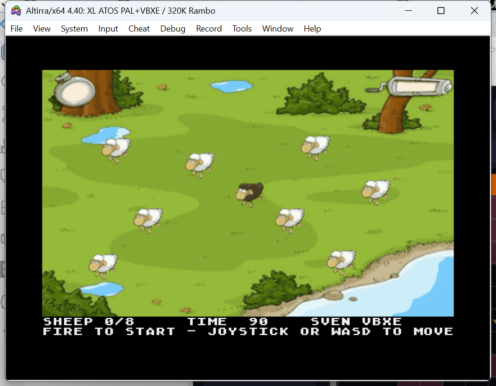

# Sven VBXE

A playable native Atari XL/XE adaptation of the adjacent Pixi Sven workshop.
Find all eight sheep within 90 seconds: move Sven close to each sheep and press
fire. The supplied JavaScript `Game.start()` is empty, so this implements a new
small game using the supplied artwork.



## Controls

| Action | Atari controls | Keyboard alternative |
| --- | --- | --- |
| Move | Joystick port 0, including diagonals | Hold WASD |
| Start / collect / replay | Fire | Space |
| Pause / resume | SELECT | P |
| Restart | START | R |
| Toggle sound | OPTION | — |

The ready screen waits for fire. Collected sheep disappear in a smoke animation;
Sven and the sheep overlap according to their feet positions. Winning and timing
out both offer replay. Pause freezes the timer, movement, and effects. Restart,
pause, fire, and mute respond to new presses rather than repeating while held.
Keyboard movement follows the Atari's single-key hardware state; joystick input
supports diagonals and simultaneous movement/fire.

## Build, test, and run

Requires MADS, Python 3.8+, and Pillow. The dependency files pin the versions
used for verification. From this directory:

```sh
python3 -m pip install -r requirements-test.txt
./verify.sh
./run-emulator.sh
```

`build.sh` needs only `requirements-build.txt`. `verify.sh` rebuilds and runs the
assembled-code tests; `run-emulator.sh` rebuilds and opens the shared Altirra
launcher. The standalone **`sven-vbxe.xex`** includes all graphics and needs no
browser, JavaScript runtime, or external disk assets on the Atari.

Use an Atari XL/XE with 64 KB RAM and VBXE FX 1.2x (preferably 1.26), shared
memory disabled. Registers at `$D600` and `$D700` are detected automatically.
A machine without VBXE displays a requirement message. The launcher reuses the
existing emulator profile; see the shared [VBXE toolkit](../../../atari-vbxe-toolkit/LLM-QUICKSTART.md).

The initial sandboxed Windows launch failed with a WSL socket error. Running
the local launcher outside that sandbox succeeded; no emulator device or
persistent profile changes were needed.

## Rendering and timing

The original meadow and 38 sprite frames use one indexed palette: 16 walking,
four idle, four sheep directions, and 14 disappearance frames. Artwork uses a
common 40% scale, bottom-centered in 56×32 sprites, so individual frames do not
change scale as Sven walks. The current sheep face down; the other directions
are included for later behavior changes.

VBXE displays a 320×200 overlay above two ANTIC text rows. The blitter restores
the meadow and draws transparent actors into the hidden framebuffer. The XDL
switches at vertical blank; row-address tables avoid per-sprite multiplication.

Simulation runs at 50 ticks per second on both PAL and NTSC. A coherent 16-bit
OS clock counts actual elapsed video frames, including skipped renders and
clock wrap. Each outer frame processes at most five movement/effect ticks after
a long stall, preventing large position jumps; the countdown still consumes
all elapsed time. POKEY collection and ending sounds use finite envelopes.

## Verification and scope

[TESTING.md](TESTING.md) records build details, CPU/blitter tests, emulator
screenshots, and remaining limits. [DEVELOPMENT.md](DEVELOPMENT.md) records the
review, proposed improvements, and implementation passes. The local Altirra PAL
playthrough reaches eight sheep and successfully replays. The automated model
also covers both register pages and both PAL/NTSC timing rates.

This is a single-meadow collection game. Scenery is decorative, with movement
bounded to the central field; sheep do not wander. There is no dog AI, original
soundtrack, or original Sven interaction animation. Physical VBXE hardware and
actual NTSC/D700 emulator configurations remain separate verification targets.

## Source layout and credits

- `sven-vbxe.asm`: XEX asset loader, VBXE detection, display/palette setup.
- `game.asm`: clock, controls, collection, states, and POKEY envelopes.
- `renderer.asm`: depth ordering, blits, XDLs, and HUD.
- `tools/make_assets.py`: deterministic conversion of the adjacent artwork.
- `tools/test_runtime.py`: assembled XEX tests with py65 and a VBXE model.
- `tools/emulator-*.ps1`: local window capture and input test scenarios.

Thirty-three XEX INIT segments upload 4 KB banks through the `$9000` MEMAC
window. VRAM `$00000`/`$10000` hold the two framebuffers, `$20000` the meadow,
`$2FA00` the sprites, and `$7F000` the XDLs/blitter command. Main code and data
remain below `$8000`; no CPU RAM expansion is used.

VBXE conventions were checked against the nearby Sulka/Porter ports, the
workspace probe, and the parent folder's `strp/vbxe` resource loader. The supplied
workshop README attributes its captured Sven Bomwollen artwork to Phenomedia AG.
Those asset rights and credits still apply; this adaptation does not relicense
them.
