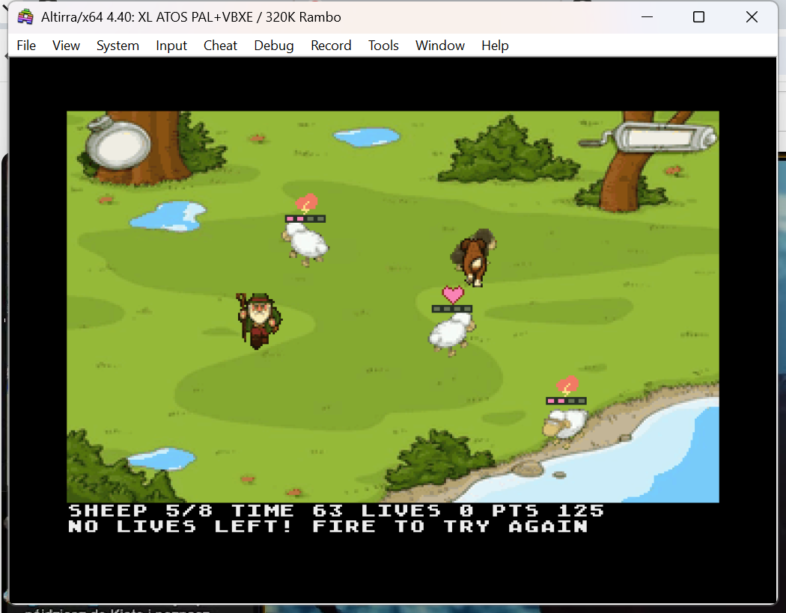

# Sven VBXE — moods and devil sheep milestone

A native Atari XL/XE arcade adaptation inspired by the original 2002 Sven
Bømwøllen. Make all eight sheep happy before time or your three lives run out.
The dog pursues Sven, the shepherd patrols, and neglected sheep become dangerous.



## Playing

The game opens on an illustrated title screen: proud Sven surrounded by
lovestruck sheep and comic heart bubbles, styled after the supplied original
character reference. Press Fire or Space to enter the meadow. The 320×200 title
uses its own palette; gameplay colors are restored when starting.

Move close to a sheep and **hold fire while standing still** to fill its four
progress segments. Sunny sheep are quicker to help than cloudy ones. Completed
sheep earn 25 points and add two seconds to the timer, then disappear.
The existing directional love animation plays while holding fire near a sheep.
The battle cloud appears at Sven’s contact point with the dog or shepherd.
Interaction progress stays with the sheep if you need to escape.

Mood symbols progress through sun, partial cloud, dark raincloud and lightning.
**Double-press fire within 0.3 seconds to whistle** and calm sheep before the
lightning stage. Red devil sheep electrically stun Sven and subtract points.
Dark-cloud sheep refuse interaction; lightning and devils cannot be whistled calm.

Avoid the brown dog and the bearded shepherd. A hit costs one life and relocates
Sven to a safe spot. Sven blinks during brief protection; move away before it
expires. **Enter a blue pond or the shoreline water to escape without losing a
life.** Water relocates Sven and grants short protection too.

The dog rests periodically. Use those pauses and the shepherd's patrol route to
choose when to stop and help a sheep. Clearing the flock wins; losing all three
lives or running out of time ends the game. Fire offers a fresh game afterward.

| Action | Atari | Keyboard alternative |
| --- | --- | --- |
| Move | Joystick port 0, including diagonals | Hold WASD |
| Start / interact / replay | Fire; hold beside a sheep | Space |
| Whistle | Double-press fire within 0.3 seconds | Double-tap Space |
| Pause / resume | SELECT | P |
| Restart | START | R |
| Toggle sound | OPTION | — |

Keyboard movement follows Atari's single-key hardware state. Joystick supports
simultaneous movement/fire; interaction requires stopping. Holding fire at an
ending does not repeatedly restart the game.

## Build and run

From the game directory (`steamlinejs/pixi-sven-master`):

```sh
./run-emulator.sh
```

This rebuilds and opens the XEX with the shared persistent Altirra profile.
Build/test directly from `atari`:

```sh
python3 -m pip install -r requirements-test.txt
./verify.sh
```

MADS is also required. `build.sh` needs only `requirements-build.txt`; py65 is
used only by tests. The standalone `sven-vbxe.xex` includes the graphics and needs
no browser, JavaScript runtime, external disk assets, or CPU RAM expansion.
The build also refreshes `sven-vbxe.sha256`.

Target: Atari XL/XE with 64 KB RAM and VBXE FX 1.2x, preferably 1.26, shared memory
disabled. Both `$D600` and `$D700` register pages are detected. A machine without
VBXE displays a requirement message. See the [VBXE toolkit](../../../atari-vbxe-toolkit/LLM-QUICKSTART.md)
for emulator setup. A sandboxed Windows/WSL launch may need to run outside that
sandbox; the local Altirra tests succeeded that way.

## What this milestone implements

- One meadow, individual sheep moods, persistent interaction progress, and whistle.
- A pursuing/resting dog and a patrolling shepherd, with animated directional sprites.
- Three lives, safe respawns, brief stun/protection, and visible-water escape routes.
- Score and time bonuses, pause, restart, mute, win, and loss states.
- A 320×200 indexed VBXE overlay, depth-sorted actors, mood/progress icons, and
  two ANTIC HUD rows. Sound uses finite POKEY envelopes.

Simulation runs at 50 ticks per second on PAL and NTSC, using coherent OS clock
deltas. After a long stall, movement/effects catch up at most five ticks per
outer frame while the countdown consumes the elapsed time.

The original JS folder is a workshop starter with an empty `Game.start()`.
This is a researched gameplay adaptation, not recovered original game code.
Enemy speeds, interaction durations, and bonuses are tuning choices for this
milestone. More levels, mushrooms, UFOs, and the original soundtrack are outside
this milestone. [MILESTONE.md](MILESTONE.md) documents the rules and source references.

## Verification and assets

[TESTING.md](TESTING.md) records the current executable, model checks, full
input-only playthroughs, actual Altirra PAL evidence, and remaining limits.
`verify.sh` runs both the mechanics suite and full simulated playthroughs with
enemies enabled. `tools/emulator-milestone.ps1` runs local visual/input scenarios.

The original meadow, Sven, sheep, and smoke artwork come from the adjacent
workshop. Its README attributes that captured artwork to Phenomedia AG; those
credits and rights still apply. The new dog/shepherd atlas was created for this
adaptation with the built-in imagegen tool. Its source and generation prompt are
in [assets](assets/README.md). Mood/progress icons are small code-defined graphics.

The 106 sprite frames use a common 56×32 slot. Eighty 4 KB INIT uploads populate
VBXE memory. Framebuffers occupy `$00000`/`$10000`, the meadow starts at `$20000`,
sprites at `$2FA00`, the title at `$60000`, and XDLs/blitter commands at `$7F000`. CPU code, tables, and
the 8 KB water mask remain below `$8000`.

`53f280f` is the Git checkpoint of the tested collection-game version preceding
this milestone. Unrelated Atari projects are outside this change.

## Living sheep milestone

Sheep wander slowly near their starting positions, avoiding water. When Sven
comes close they stop and face him, so holding fire remains practical. Whistling
calms nearby sheep, turns them toward Sven and displays a heart for 1.5 seconds.
Progress bars remain visible. All four existing directional love sequences are
used. Pause freezes wandering and reactions; restart restores the flock.

`./verify.sh` includes `tools/test_sheep.py`, which checks wandering, water and
home bounds, four-direction facing/interaction, whistle reactions and restart.
See [verification](evidence/sheep-tests.txt) and [Altirra whistle screenshot](evidence/sheep-whistle-altirra.png).

## Dog and interaction adjustments

Love progress takes 1.28 seconds for sunny sheep and 1.92 seconds for cloudy
sheep (four segments). Sven's approach direction selects one of the four
existing love sequences and stays fixed during that interaction. Releasing fire
restores Sven and the sheep immediately; completing an interaction removes the
combined sprite immediately, preventing a second Sven from lingering.

The dog is larger, keeps a stable diagonal heading, and interrupts its rest to
pursue at double speed for two seconds when a new interaction begins.

## Moods, devil sheep and mushrooms

| Mood | Behavior |
| --- | --- |
| Sun (0–19 seconds) | Calm; normal love progress |
| Sun/cloud (20–34 seconds) | Impatient; slower love progress |
| Dark raincloud (35–49 seconds) | Walks faster and refuses interaction; double-fire whistle can calm it |
| Lightning (50–51 seconds) | Flashes before transformation; whistles no longer help |
| Red devil (from 52 seconds) | Horned red sheep charges and makes sideways runs |

A devil shock stuns Sven in place for two seconds and deducts 10 points, with
points never going below zero. The shock itself takes no life. The dog and
shepherd can still catch Sven while he is stunned. A short shock cooldown
prevents repeated point deductions on every frame.

**Golden mushroom:** double movement speed for five seconds. **Purple/green
mushroom:** odor pushes nearby sheep immediately into lightning warning.
Each mushroom is consumed once per game; restart restores both.

For this adaptation, a devil exhausts after eight seconds and returns to cloudy
mood, allowing the flock to be completed. These timings and the recovery rule
are game-balance choices, not verified original constants. Water escapes choose
among safe sites using the current frame and entry position, without life loss.
There are no UFO mechanics.

Artwork and generation prompts: [assets/DEVILS.md](assets/DEVILS.md).
